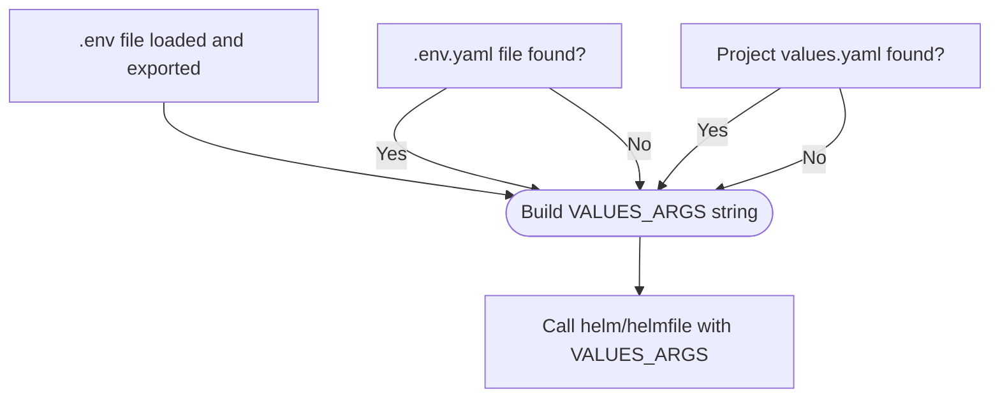

# Proposed `.env`-only Workflow Fix for `start_chart.sh`

## Problem  
Chart install fails if `.env.yaml` is missing, but the new policy is to use only `.env` for all values and secrets. The script must never require `.env.yaml`.

## Solution  
**Patch locations:**  
- All locations where `VALUES_ARGS="--values .env.yaml"` appear.
- Replace with logic:  
    1. `VALUES_ARGS=""` by default  
    2. Only append `--values .env.yaml` if that file exists  
    3. Leave `$VALUES_FILE` inclusion unaffected.

**Example shell:**  
```bash
VALUES_ARGS=""
if [ -f ".env.yaml" ]; then
    VALUES_ARGS="--values .env.yaml"
fi
if [ -f "$VALUES_FILE" ]; then
    echo "Using project-level values file: '$VALUES_FILE'."
    VALUES_ARGS="$VALUES_ARGS --values \"$VALUES_FILE\""
fi
```

**Result:**  
- No error if `.env.yaml` is missing.
- All config is taken from `.env` environment for both Helm and Helmfile deploys.
- `.env.yaml` will be used **only if present**, not required by policy.

---

## Mermaid Flow Diagram



---

Let me know if you approve this plan. Once approved, I will switch to code mode and patch `k8s/start_chart.sh` accordingly.