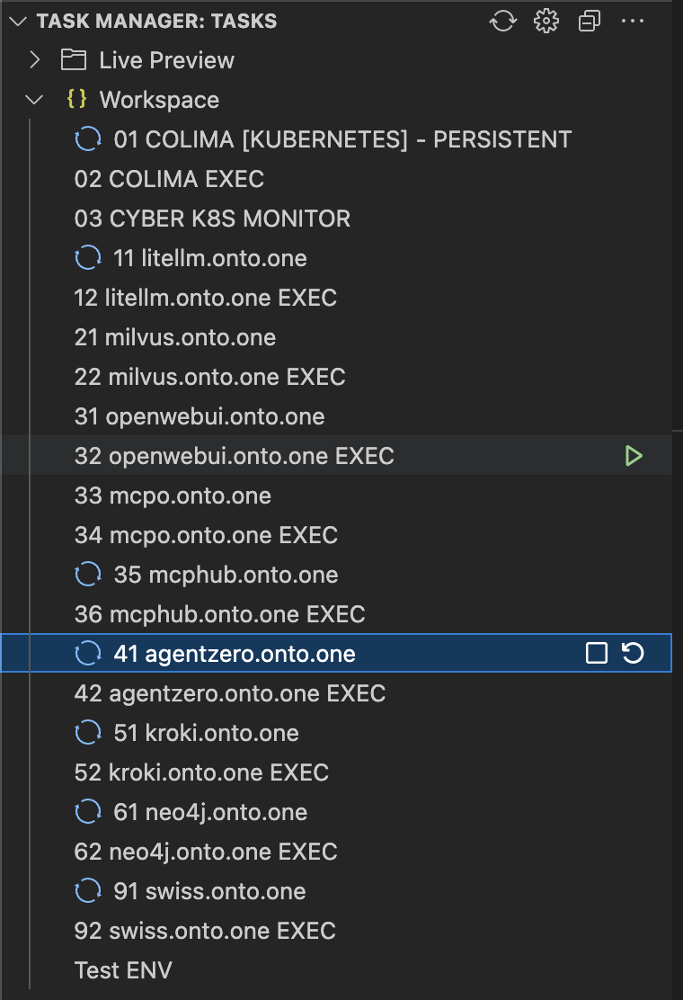
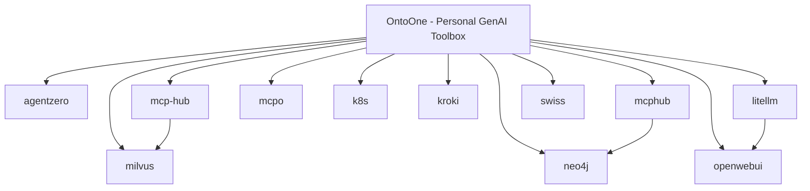

# OntoOne - Personal GenAI Toolbox

[](./LICENSE)
[](https://discord.gg/sTbfxV9xyU)
> **Project Aim:**
> This repository is a rapid toolbox for running production-grade GenAI systems—built on vendor-maintained charts where possible, and actively supporting smaller projects’ Kubernetes onboarding by contributing integrated charts with ingress, DNS, certificates, and robust deployment strategies. All chart configuration flows from a single point of truth, enabling persistence that lets you safely shut down and restart any workload with full data continuity.

> **VSCode Task Experience:**
> This project harnesses the native Visual Studio Code Task system, enhanced by a lightweight extension, to deliver one-click "PLAY", "STOP", and activity-feedback controls directly in your editor. Whether launching a chart, monitoring tokens, running evals, or exploring model flows, you execute, observe, and iterate rapidly via familiar icons—saving you measurable time on routine cycles.

<p align="center">
  
</p>
---

> **Design/Tested Platform:**
> Developed and tested on MacBook M-series.
> **Minimum requirements:** 16GB RAM, 64GB recommended.
>
> **Startup Benchmarking:**
> - Kubernetes (prewarmed): ~30 seconds
> - LiteLLM Proxy: ~10 seconds
> - AgentZero: ~30 seconds
> - Milvus: ~120 seconds (startup + integrity checks)

---

## 🚀 Modular Architecture Overview

This repository provides a plug-and-play Kubernetes AI platform, with each folder below representing a composable module. Use the provided `helmfile_start.sh` scripts  for launching/restarting modules.

### **Repository Modules**
| Module/Folder | Description & Link to Docs                                       |
|---------------|----------------------------|-------------|
| Module/Folder | Description & Link to Docs | Chart Origin |
|---------------|----------------------------|-------------|
| [`agentzero/`](agentzero/)   | Free and open source autonomous AI agent           | Contrib      |
| [`kroki/`](kroki/)           | Diagram microservice (Kroki) Helm integration      | Vendor       |
| [`litellm/`](litellm/)       | Versatile LLM API proxy – integrates with OpenWebUI | Vendor      |
| [`mcphub/`](mcphub/)         | MCP Orchestration UI: hosts/displays MCP server executions, includes web UI for detailed tracking and management of MCPs. | Contrib      |
| [`mcp-hub/`](mcp-hub/)       | [WIP] CLI tool for hosting MCP servers as REST/OpenAPI services, supports endpoint-driven hot-reload and dynamic parameter updates. | [WIP]/Contrib |
| [`mcpo/`](mcpo/)             | AI agent orchestration, flows, graph logic          | Contrib      |
| [`milvus/`](milvus/)         | Milvus vector DB Helm chart                         | Vendor       |
| [`neo4j/`](neo4j/)           | Neo4j database integration for graph/data modeling  | Vendor       |
| [`openwebui/`](openwebui/)   | Chat front-end + UI                                 | Vendor      |
| [`swiss/`](swiss/)           | Swiss army tools — utility Helm bundle              | Contrib      |

_Note: All images used in documentation are located in [`.vscode/img/`](.vscode/img/)_

---

_† Charts marked as 'Vendor' are installed directly via `helm repo add ...`; see the 'Required Helm Repositories' section below for details._

---

### Cluster Orchestration & Utilities

| Component           | Description                                                                                                            |
|---------------------|------------------------------------------------------------------------------------------------------------------------|
| K8S Launcher        | Binds our single point of truth (central configuration) with the Colima runtime. Presents multi-stage status screens during startup, operation (cycling info), and termination—filtering for clear shutdown confirmation. |
| Helmfile Launcher   | Launches and manages Helmfile deployments, unified configuration injection, and lifecycle orchestration for all workloads.                                   |

---

## Platform & Storage Architecture

- **Platform:** This stack currently runs on macOS only, leveraging [Colima](https://github.com/abiosoft/colima) with its native Rancher K3s (Kubernetes) integration for zero-hassle local clusters.
  Service exposure uses k3s's native [klipper-lb](https://rancher.com/docs/k3s/latest/en/networking/#service-loadbalancer) (klipper-load-balancer), which enables built-in LoadBalancer-type services—no external load balancer needed for local development.
- **Helm Philosophy:** All services are deployed using Helm charts. If an official vendor Helm chart exists, it is used as-is wherever possible; overrides are achieved via a thin `helmfile.yaml.gotmpl` without forking or modifying vendor values.yaml—ensuring compatibility and upgrade path.
- **Storage Layer:** Persistent storage uses Rancher's local storage provisioner. All important persistent volumes (PVCs) reside in `/var/lib/rancher/k3s/storage` inside the Colima VM. For advanced users, this path (and thus all workload data) may be further mapped/mounted to the host filesystem for backup, inspection, or persistence beyond the VM's lifecycle.

---

### Project Architecture



---

**The fastest way to run your own AI stack—on your laptop, with real SSL, real domains, and real power.**

1. **Load VSCode**
2. **Add the Task Manager extension**
3. **Clone this repo**
4. **Click "Start" (get instant Kubernetes)**
5. **Click, click, click—OpenWebUI, Milvus for blazing-fast vector storage, all streaming through LiteLLM for full model and token control.**
6. **MCPO for orchestration.**
7. **Coming soon: AgentZero—the last agent automation you'll ever need. Absolutely mind-blowing.**

No Docker Desktop. No cloud. No waiting.
Just you, your laptop, and a full-featured, self-hosted AI playground—up and running in seconds.

- **First button:** Starts Colima Kubernetes (Task 01).
- **Other buttons:** Instantly deploy Helm charts for your chosen projects. When you stop a task, the Helm chart is uninstalled and resources are freed.
- **Persistence:** All work is stored on your workstation, so data is preserved between sessions.
- **Resilience:** The system is designed for eventual consistency and can recover from interruptions or shutdowns. For critical data, use backups, but for day-to-day playground use, this is ideal.

---

## Mini Task Table

| Task Label                  | What it Does                                      |
|-----------------------------|---------------------------------------------------|
| 01 COLIMA [KUBERNETES]      | Starts Colima in Kubernetes mode                  |
| 03 CYBER K8S MONITOR        | Monitors Colima and Kubernetes logs               |
| 11 litellm.onto.one         | Deploys Litellm Helm chart                        |
| 21 milvus.onto.one          | Deploys Milvus Helm chart                         |
| 31 openwebui.onto.one       | Deploys OpenWebUI Helm chart                      |
| 33 mcpo.onto.one            | Deploys MCPO Helm chart                           |
| 91 swiss.onto.one           | Deploys Swiss Helm chart                          |

_Use the VSCode Task Manager extension to launch these tasks. EXEC tasks (shell access) are available but not listed here._

---

## 1. Prerequisites

- **macOS** (tested on Apple Silicon and Intel)
- [Colima](https://github.com/abiosoft/colima) (container runtime for macOS)
- [mkcert](https://github.com/FiloSottile/mkcert) (for local SSL certificates)
- [Visual Studio Code](https://code.visualstudio.com/)
  - Extension: **Task Manager** (`cnshenj.vscode-task-manager`)

---
## 2. Quick Installation

**Install all required tools and dependencies:**
```sh
# Core tools: Colima (Kubernetes VM), mkcert (local SSL), guest agents (optional), Python deps for helper scripts
brew install colima mkcert lima-additional-guestagents
mkcert -install
pip install -r .vscode/requirements.txt
```
- **Colima**: Local Kubernetes cluster using macOS virtualization.
- **mkcert**: Instantly generates trusted SSL certificates for local domains.
- **lima-additional-guestagents**: (Optional) Suppresses Colima guest agent warnings.
- **Python requirements**: Needed for VSCode helper scripts.

**Generate a wildcard certificate for your local domain (output to `k8s/`):**
```sh
cd k8s && mkcert "*.onto.one" onto.one
```
This creates a `.pem` certificate and a `-key.pem` private key in the `k8s/` directory for your local services.

**Environment configuration:**
- New users should copy `.env.example` to `.env` in the root of the repository:
  ```sh
  cp .env.example .env
  ```
- Edit `.env` to set your personal secrets and configuration options. This file is ignored by git and is unique to your setup.
**Configure your environment:**
Edit `.env` to set the container runtime and memory:
```sh
# Options: "containerd" (default, uses nerdctl), "docker" (uses Docker if installed)
COLIMA_RUNTIME=containerd
# Suggestions: 8 (safe for most), 16 (for more workloads), 48 (only if you have >64GB RAM)
COLIMA_MEMORY=8
```

**Kubeconfig setup:**
- The kubeconfig is automatically extracted on first Colima start.
- To refresh manually:
  ```sh
  colima ssh --profile k8s -- cat /etc/rancher/k3s/k3s.yaml > ~/.kube/config
  ```

**After setup:**  
Use the VSCode Task Manager extension to start Colima and deploy your AI stack with one click.

---


## 2. Quick Installation

Colima supports two container runtimes:
- **containerd** (default, uses `nerdctl` CLI)
- **docker** (uses Docker if installed)

**By default, this project uses `containerd` with the `nerdctl` CLI for container management.**
- If you already have Docker installed and prefer to use it, set `COLIMA_RUNTIME=docker` in your `.env` file.
- If you use the default (`containerd`), you will use `nerdctl` commands (e.g., `nerdctl ps`, `nerdctl images`). For convenience, you can alias `docker` to `nerdctl` in your shell:
  ```sh
  alias docker='nerdctl'
  alias docker-compose='nerdctl compose'
  ```
- Most Docker CLI commands are compatible with `nerdctl`, but some advanced features may differ.

**We use Kubernetes mode.**

### Install Colima

```sh
brew install colima
```

### Configure Runtime (Optional)

Edit your `.env` file to set the container runtime:
```sh
# Options: "containerd" (default, uses nerdctl), "docker" (uses Docker if installed)
COLIMA_RUNTIME=containerd
```
If you have Docker installed and want to use it, set:
```sh
COLIMA_RUNTIME=docker
```

---

## 3. Folder Mapping & Data Persistence

To ensure all pod/container data is stored on your workstation (and not inside Colima or containers):

- Map a folder from your workstation to Colima.
- Map from Colima to each container/pod.

**Result:**  
Pods write output directly to your workstation disk.  
You can destroy Colima, stop all pods, erase and reinstall everything, and your data will persist as long as it stays in the mapped location.

---

## 4. VSCode Integration & Helper Files

- Helper scripts and configuration files are in the `.vscode` folder.
- The main set of tasks is in `.vscode/tasks.json`.
- **Required VSCode extension:**  
  [Task Manager](https://marketplace.visualstudio.com/items?itemName=cnshenj.vscode-task-manager) (`cnshenj.vscode-task-manager`)

  <p align="center">
  
</p>

---

## 5. Networking, Load Balancer & Certificates

- Load balancer is configured to expose services on low ports.
- SSL certificates are generated for a seamless browsing experience (no need to remember port numbers).
- You can access services by name (e.g., `milvus.onto.one`) instead of port numbers.

---

## 6. Domain: onto.one

- The domain `onto.one` (registered by PeterS) always points to `localhost`.
- This allows you to create subdomains for each service (e.g., `milvus.onto.one`).
- The wildcard `*.onto.one` points to `127.0.0.1` for local development.
- No need to modify your local DNS system.

**Example:**  
Creating a new service called `milvus` will:
- Create a project and namespace `milvus`
- Expose it at `milvus.onto.one`
- Wildcard DNS ensures it resolves to your local machine

**If you prefer, you can manually add entries to your `/etc/hosts` file.**

---

**Breadcrumb:** Home (README.md)

[Next: TASKS.md →](TASKS.md)


## Required Helm Repositories

| Repo Name    | URL                                      | Used For         |
|--------------|-------------------------------------------|------------------|
| cowboysysop  | https://cowboysysop.github.io/charts/     | Kroki Helm chart |
| neo4j        | https://helm.neo4j.com/neo4j              | Neo4j Helm chart |

**Before running any Helmfile commands, add the required repos:**

```sh
helm repo add cowboysysop https://cowboysysop.github.io/charts/
helm repo add neo4j https://helm.neo4j.com/neo4j
helm repo update
```
