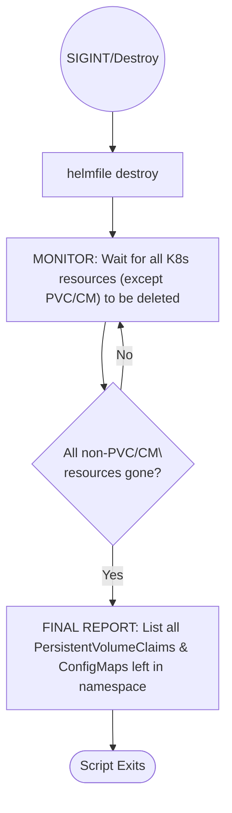

# Helmfile Destruction Sequence and Persistent State Specification

This document describes the destruction and monitoring sequence performed by `start_chart.sh` when uninstalling the litellm Helm release, including logic for handling persistent resources like PVCs and ConfigMaps.

## Key Requirements

- After SIGINT or explicit destruction, the script initiates `helmfile destroy` for the current namespace.
- Destruction monitoring *excludes* PersistentVolumeClaims (PVC) and ConfigMaps (CM) from termination checks, since these often persist after destroy.
- Once all other Kubernetes resources in the namespace are deleted (pods, deployments, services, ingresses, etc.), a **final report** step is triggered.
- In the final report stage:
  - The script verifies that Helmfile uninstall was successful (i.e. all resources but PVC/CM are gone).
  - Any remaining PVCs and ConfigMaps in the namespace are listed as expected persistent leftovers.
  - The user is informed that stateful resources (PVC/CM) persist by design.
- The script only terminates after presenting the final report.

---

## Mermaid Diagram (Destruction State Machine)

---

## SVG Export

The above Mermaid diagram should be exported as an SVG and saved as `k8s/helmfile_destroy_flow.svg`.

---

## Usage

- Reference or embed the SVG diagram in **start_chart.md** and any other relevant documentation.
- Keep this file in sync with script logic whenever destruction/final report flow changes.